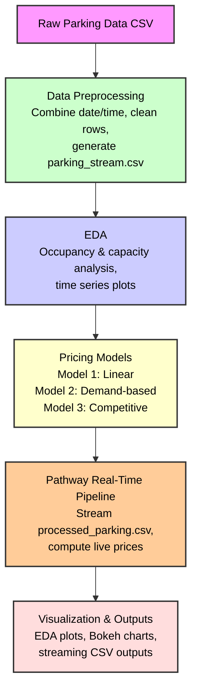

# 🚗 Dynamic Pricing for Smart Parking — Capstone Project

This project implements dynamic pricing strategies for smart parking lots using occupancy data, demand factors, and competitive pricing, along with a real-time pipeline for live price updates.

---

## 📚 Tech Stack

- **Python 3.8+**
- **Pandas** for data preprocessing and analysis
- **Matplotlib & Seaborn** for EDA visualization
- **Pathway** for real-time data ingestion and streaming price computation
- **Bokeh** for optional interactive visualizations
- **Jupyter Notebook** as the primary development environment

---

## ⚙️ Architecture Flow

1️⃣ **Data Ingestion & Preprocessing**  
   - Read raw parking data.
   - Combine date & time into a timestamp.
   - Sort chronologically and clean invalid entries.
   - Generate a reduced dataset (`proessed_parking.csv`) with relevant features.

2️⃣ **Exploratory Data Analysis (EDA)**  
   - Analyze occupancy, capacity, and time-series trends.
   - Identify patterns for price modeling.

3️⃣ **Pricing Models**  
   - **Model 1:** Linear occupancy-based pricing.
   - **Model 2:** Demand-based dynamic pricing using occupancy, queue length, traffic, vehicle type, and special days.
   - **Model 3:** Competitive pricing with neighbor lot comparison and rerouting suggestions.

4️⃣ **Real-Time Pipeline (Pathway)**  
   - Ingest `parking_stream.csv` as a simulated data stream.
   - Compute live prices for Models 1 & 2.
   - Emit results to CSV for visualization or system integration.

5️⃣ **Visualization**  
   - Offline: Time-series plots for model comparison.
   - Optional: Live updates with Bokeh or other dashboards.

6️⃣ **Insights & Recommendations**  
   - Interpret model behaviors and suggest pricing strategies for city parking management.

---

## 📊 Architecture Diagram

---

## 📝 Details of Pricing Models

- **Model 1:** Linear price increase with occupancy — encourages early parking, deters parking when lots near full.
- **Model 2:** Dynamic pricing factoring queue length, traffic, vehicle type, and special days — more context-aware.
- **Model 3:** Price adjustments based on nearby lots’ prices + rerouting if lot is full — balances supply and demand across locations.

---

## 🚀 How to Run

1. **Run the notebook:**
   - Open `SA_2025_FinalCapstoneProject.ipynb` in Jupyter or VS Code.
   - Execute cells sequentially for EDA, Models 1–3, and final plots.

2. **Check output:**
   - Plots of occupancy and price trends are generated in the notebook.

---

## 📌 Recommendations

- Dynamic pricing helps distribute parking demand, reduce congestion, and improve revenue.
- Demand factors (queue, traffic, vehicle type) significantly improve pricing precision.
- Competitive pricing with rerouting can optimize occupancy city-wide.

---

## ✅ Deliverables

- Final working notebook: `SA_2025_FinalCapstoneProject.ipynb`
- GitHub repository with this README (with architecture diagram) and code

---
